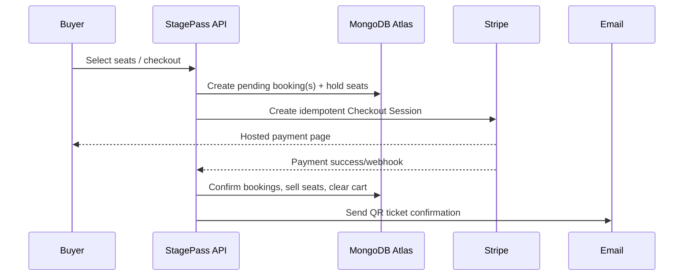
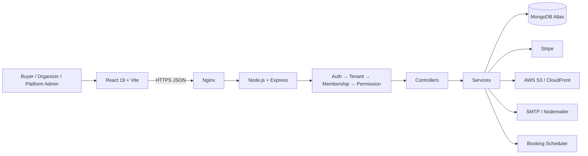

<div align="center">

# 🎟️ StagePass
### Multi-Tenant Event Ticketing Platform

**A complete operating system for event organizers, teams, and ticket buyers.**

[](https://react.dev/) [](https://vite.dev/) [](https://nodejs.org/) [](https://www.mongodb.com/atlas) [](https://stripe.com/) [](https://aws.amazon.com/s3/)

`Multi-tenant` · `Seat maps` · `Bundles` · `Stripe checkout` · `QR tickets` · `Team permissions`

</div>

---

## What is StagePass?

StagePass is a SaaS-style, multi-tenant event ticketing platform. Independent organizations create venues, events, seat maps, bundles, coupons, teams, and analytics in one app. Buyers discover events, reserve precise seats, pay securely, and manage every ticket from one premium hub.

| Workspace | Experience |
| --- | --- |
| **Buyer Hub** | Browse events, global cart, bookings, wallet, referrals, rewards, refunds, and profile. |
| **Organizer Console** | Venue/event/seat-map creation, bundles, coupons, media, team permissions, bookings, analytics, and seat changes. |
| **Platform Admin** | Global analytics, organization inspection, audit activity, suspension controls, and AI assistance. |

## Multi-tenancy, explained

One StagePass deployment serves many independent organizations without mixing their data.

```text
One StagePass application + one MongoDB cluster
├── Organization A → venues, events, members, bookings, coupons
├── Organization B → venues, events, members, bookings, coupons
└── Organization C → venues, events, members, bookings, coupons
```

Every organization has a unique slug, such as `tech-conference-lahore`. Tenant API routes use `/api/o/:orgSlug/...`; `resolveTenant` resolves that slug and attaches its `organizationId` before any business logic runs. Every tenant-owned database query is scoped with that ID:

```js
// Structurally prevents an event from another tenant being returned.
Event.findOne({ _id: eventId, organizationId });
```

Users are global identities, but roles are organization-specific. The same user can own one organization and be staff in another.

## Feature tour

### Buyer journey

- Public landing page for guests; authenticated users go directly to `/browse`.
- Cross-organization event and bundle discovery with search/filtering.
- Private event/bundle access codes with optional expiry.
- Responsive buyer sidebar: Browse, Organizations, Cart, Bookings, Wallet, and Referrals. Profile/logout stay in the top control.
- Visual seat selection with live colors: **yellow** available, **green** held, **red** sold.
- Optional YouTube event video embedded directly on the event page.
- Guest cart persistence; guest carts are claimed after login and do not leak between accounts on the same browser.
- One global cart can combine individual events and bundles; one Stripe Checkout session charges the combined total.
- Cart seat editing, bundle editing, valid-item-only coupons, and automatic cart clearing after confirmation.
- Booking pages with true combined order totals, event date/time, QR codes, ticket details, refunds, and seat-change status.
- Wallet transaction history, referral links/rewards, and buyer dashboard quick actions.

### Organizer journey

- Organization creation plus owner/admin/staff team membership.
- Dynamic per-member permissions for venues, events, team, settings, bundles, coupons, media, and seat changes.
- Optional staff venue scope: specific assignments restrict visibility; no explicit scope means normal permission-based access.
- Venue management, timezone-aware events, multiple sessions, banners/media, private access, and booking-opening scheduling.
- Visual venue/event seat-map builders and seat category pricing.
- Event bundles that still generate individual event QR tickets.
- Event- and bundle-level coupon codes with expiry/usage rules.
- Booking lookup by confirmation code or booking ID.
- Seat-change request approval/rejection, media gallery, organization settings, and analytics.

### Payment, ticketing, and notifications



- Application and Stripe idempotency prevent duplicate checkout/confirmation.
- Scheduler releases expired holds/carts and sends one aggregated payment reminder.
- Email confirmation aggregates the order total while keeping each event’s confirmation code/QR ticket.
- Every event in an email receives its own **View on Map** link.
- One `.ics` download adds all events from a checkout to Google Calendar, Outlook, or Apple Calendar.

## Architecture



```text
Route → Middleware → Controller → Service → Mongoose Model → MongoDB
```

| Layer | Responsibility |
| --- | --- |
| Routes | URL + HTTP method, middleware composition. |
| Middleware | JWT auth, tenant resolution, membership, permissions, uploads, venue scope. |
| Controllers | Thin HTTP boundary; calls services and returns JSON. |
| Services | Business rules, transactions, integrations, tenant-safe queries. |
| Models | Mongoose schemas, indexes, validation, persistence. |

## Project structure

```text
├── backend/
│   ├── src/config/        # MongoDB, Stripe, SMTP, AWS
│   ├── src/controllers/   # HTTP handlers
│   ├── src/middlewares/   # auth, tenancy, permissions, uploads
│   ├── src/models/        # Mongoose schemas
│   ├── src/routes/        # Express API routers
│   ├── src/services/      # business logic + scheduler
│   └── src/app.js / server.js
├── frontend/src/
│   ├── api/ components/ context/ pages/ utils/
└── Docs/TECHNICAL_DOCUMENTATION.md
```

## Core data model

| Model | Scope | Purpose |
| --- | --- | --- |
| `User` | Global | Identity, profile, platform role. |
| `Organization` | Tenant | Tenant identity, slug, settings. |
| `OrganizationMember` | Tenant relation | Role, dynamic permissions, venue assignments. |
| `Venue`, `Event`, `EventBundle` | Tenant | Event inventory and selling experiences. |
| `Cart`, `Booking` | Buyer/Tenant | Cart holds, payment state, tickets, QR/confirmation data. |
| `Coupon`, `Wallet`, `WalletTransaction`, `ReferralReward` | Commerce | Discounts, wallet ledger, rewards. |
| `SeatChangeRequest`, `MediaAsset`, `PlatformAuditLog`, `AIChatSession` | Operations | Management, media, audit, AI history. |

## Routes

| Area | Important routes |
| --- | --- |
| Buyer | `/browse`, `/cart`, `/my/dashboard`, `/my/bookings`, `/my/wallet`, `/my/referrals`, `/profile` |
| Storefront | `/o/:orgSlug/events`, `/o/:orgSlug/events/:eventId`, `/o/:orgSlug/bundles/:bundleId` |
| Confirmation | `/o/:orgSlug/bookings/:bookingId/confirmation` |
| Organizer | `/o/:orgSlug/dashboard`, `/o/:orgSlug/manage/events`, `/manage/venues`, `/manage/bundles`, `/manage/team`, `/manage/coupons`, `/manage/analytics` |
| Platform | `/platform-admin`, `/platform-admin/organizations`, `/platform-admin/activity`, `/platform-admin/assistant` |

## Security and reliability

- JWT authentication, bcrypt password hashes, and Google sign-in.
- Tenant-scoped queries and role/per-member permission gates.
- Helmet, CORS allow-list, upload validation, and protected platform routes.
- Stripe webhook signature validation and transactional inventory updates.
- Seat/cart expiry, payment reminders, idempotent checkout confirmation, and MongoDB startup retry for transient DNS/Atlas outages.
- Server-side S3 upload handling through Multer in-memory buffers.

### Observability

StagePass uses **Morgan** for HTTP request lifecycle logs and **Winston** for structured application, scheduler, integration, and error logs. Logs include a request ID for tracing and redact sensitive fields. In production, output is available through PM2 and daily files in `backend/logs/`:

```bash
pm2 logs <backend-process-name>
tail -f backend/logs/combined-YYYY-MM-DD.log
tail -f backend/logs/error-YYYY-MM-DD.log
```

Files rotate daily and are retained for 14 days.

> Never commit `.env`, SMTP credentials, AWS keys, Stripe secrets, or JWT/session secrets.

## Getting started

### Prerequisites

Node.js 18+ (Node 20 LTS recommended), npm, MongoDB Atlas/local MongoDB, Stripe test keys, SMTP credentials, and AWS S3 credentials if media uploads are used.

```bash
git clone <your-repository-url>
cd Multi-Tenant-Event-Ticketing-Platform

# Terminal 1 — API
cd backend
npm install
copy .env.example .env
npm run dev

# Terminal 2 — frontend
cd frontend
npm install
npm run dev
```

Open [http://localhost:5173](http://localhost:5173).

## Environment variables

Copy [`backend/.env.example`](backend/.env.example) to `backend/.env`.

| Variable | Purpose |
| --- | --- |
| `PORT`, `NODE_ENV` | API port and environment. |
| `MONGO_URI` | MongoDB connection string. |
| `JWT_SECRET`, `SESSION_SECRET` | Long random production secrets. |
| `STRIPE_SECRET_KEY`, `STRIPE_WEBHOOK_SECRET` | Stripe payment/webhook credentials. |
| `EMAIL_HOST`, `EMAIL_PORT`, `EMAIL_USER`, `EMAIL_PASS`, `EMAIL_FROM` | SMTP mail delivery. |
| `AWS_REGION`, `AWS_ACCESS_KEY_ID`, `AWS_SECRET_ACCESS_KEY` | AWS access. |
| `S3_BUCKET_NAME`, `S3_PUBLIC_BASE_URL` | Media storage/delivery. |
| `FRONTEND_URL`, `CORS_ALLOWED_ORIGINS` | Public frontend and allowed origins. |
| `PUBLIC_API_URL` | Optional public API domain for email calendar links. |
| `ENABLE_BOOKING_SCHEDULER` | Enable on exactly one production worker/process. |

For local Stripe webhook testing:

```bash
stripe listen --forward-to localhost:5000/api/webhooks/stripe
```

## Deployment

Designed for React/Vite static hosting plus Express on Ubuntu/EC2 with Nginx and PM2:

```text
Internet → Nginx → frontend build
                 └→ /api → PM2 → Express → MongoDB Atlas
```

Production checklist:

- Run `npm run build` in `frontend/`.
- Configure production environment variables on the server—not in Git.
- Allow the EC2 server IP in MongoDB Atlas Network Access.
- Proxy `/api` through Nginx to the PM2 backend process.
- Register Stripe webhook endpoint and enable scheduler on one process only.
- Set `PUBLIC_API_URL` when API and frontend use different public domains.
- Monitor with `pm2 status` and `pm2 logs`.

## Quality checks

```bash
cd frontend
npm run lint
npm run build

cd ..
node --check backend/src/server.js
node --check backend/src/services/booking.service.js
```

Regression-test tenant isolation, permission combinations, cart claim/account switch, live seat holds, bundles, mixed checkout, coupons, confirmation email/calendar/map links, refunds, and seat changes before deployment.

## Documentation

For API contracts, complete technical decisions, and deeper database notes, see [Technical Documentation](Docs/TECHNICAL_DOCUMENTATION.md).

<div align="center">

**StagePass — make the crowd move.**

</div>
